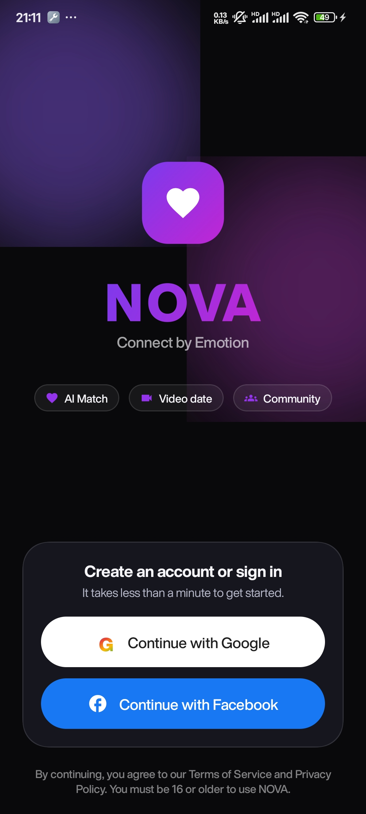
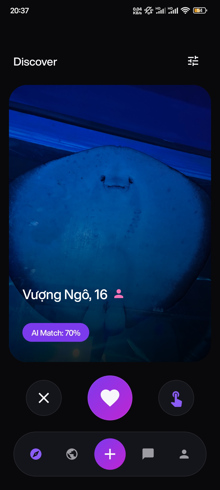
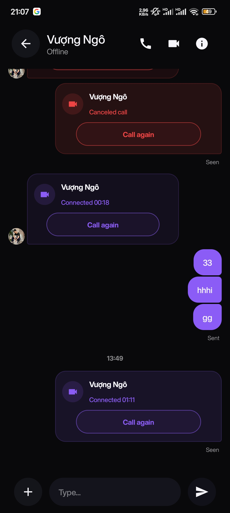
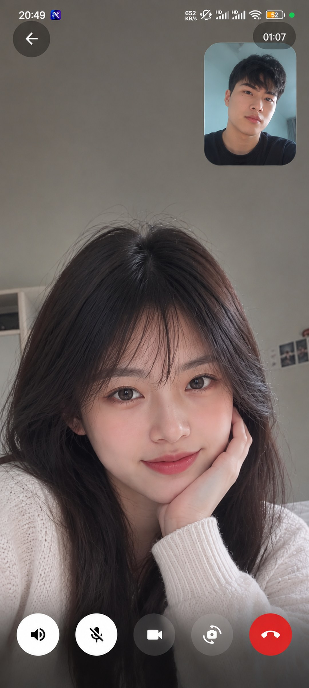
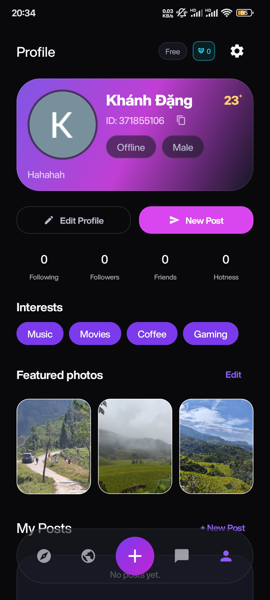

# NOVA

Ứng dụng hẹn hò và kết nối xã hội trên Android, viết hoàn toàn bằng Kotlin và Jetpack Compose. Người dùng có thể ghép đôi, nhắn tin thời gian thực, gọi thoại/video và tham gia cộng đồng. Dự án gồm ứng dụng Android và một backend Spring Boot đi kèm.

## Ảnh chụp màn hình

<table>
  <tr>
    <th>Đăng nhập</th>
    <th>Khám phá</th>
    <th>Trò chuyện</th>
    <th>Cuộc gọi video</th>
    <th>Hồ sơ</th>
  </tr>
  <tr>
    <td></td>
    <td></td>
    <td></td>
    <td></td>
    <td></td>
  </tr>
</table>

## Tính năng

- Đăng nhập Google (Credential Manager), thiết lập hồ sơ 3 bước có kiểm tra dữ liệu
- Khám phá và ghép đôi, lọc theo giới tính và độ tuổi
- Nhắn tin thời gian thực: ảnh, video, tệp, tin nhắn thoại, thu hồi, chỉnh sửa, trạng thái đã xem và đang nhập
- Gọi thoại và video 1-1 qua WebRTC
- Bảng tin cộng đồng: bài đăng nhiều ảnh/video, hashtag, gắn thẻ bạn bè, bình luận
- Hồ sơ, người theo dõi, bạn bè, tìm kiếm người dùng
- Cửa hàng VIP và kim cương
- 5 ngôn ngữ (English, Tiếng Việt, 中文, 日本語, 한국어), đổi ngay trong ứng dụng không cần khởi động lại
- Giao diện sáng/tối

## Điểm kỹ thuật nổi bật

**Gọi thoại/video như ứng dụng nhắn tin thật**
- Tín hiệu WebRTC (offer/answer/ICE) qua WebSocket, tự khởi động lại ICE khi mất mạng và hiển thị trạng thái "Đang kết nối lại"
- Foreground service (`microphone|camera`) giữ cuộc gọi khi ứng dụng chạy nền, thông báo `CallStyle` có nút cúp máy và đồng hồ
- Picture-in-picture cho cuộc gọi video khi rời ứng dụng
- Định tuyến âm thanh qua `AudioManager`: loa trong, loa ngoài, tai nghe, Bluetooth; tự chuyển khi cắm/rút thiết bị
- Nhạc chuông, âm báo chờ, cảm biến tiệm cận tắt màn hình khi áp tai
- Xử lý máy bận, hết giờ đổ chuông, cuộc gọi nhỡ, và cuộc gọi đến khi ứng dụng đã tắt qua FCM kèm full-screen intent

**Đa ngôn ngữ đổi tức thì**
- Chuỗi đặt trong `strings.xml` cho 5 ngôn ngữ
- Đổi ngôn ngữ bằng cách cung cấp lại `LocalContext`, `LocalConfiguration`, `LocalResources` trong Compose, không phải tạo lại Activity nên không mất trạng thái màn hình

**Kiến trúc**
- MVVM với luồng dữ liệu một chiều: `Repository` giữ trạng thái bằng `StateFlow`, `ViewModel` biến đổi thành UI state, màn hình Compose chỉ hiển thị và gửi sự kiện
- Tầng use case tách logic nghiệp vụ khỏi ViewModel
- Dependency injection thủ công qua một container và `ViewModelProvider.Factory`
- Coroutines và Flow cho mọi tác vụ bất đồng bộ và dữ liệu thời gian thực

## Công nghệ

| Mảng | Thư viện |
|---|---|
| Giao diện | Jetpack Compose, Material 3, Navigation Compose, Coil |
| Bất đồng bộ | Kotlin Coroutines, Flow |
| Mạng | OkHttp, WebSocket |
| Cuộc gọi | WebRTC Android SDK |
| Media | Media3 ExoPlayer, Photo Picker |
| Thông báo | Firebase Cloud Messaging |
| Xác thực | Credential Manager, Google Identity |
| Backend | Spring Boot, Spring Security, WebSocket, H2/PostgreSQL, coturn |

## Cấu trúc

```
app/src/main/java/com/nova/app/
├── core/
│   ├── backend/        API client, phiên đăng nhập, WebSocket, FCM
│   ├── call/           Foreground service, âm thanh và trạng thái cuộc gọi
│   ├── data/           Repository
│   ├── domain/         Use case
│   ├── di/             Container phụ thuộc
│   ├── i18n/           Chuyển đổi ngôn ngữ
│   ├── navigation/     Điều hướng
│   ├── viewmodel/      ViewModel
│   ├── webrtc/         WebRTC engine
│   └── ui/             Thành phần giao diện dùng chung
└── feature/            auth, discover, chat, call, community, post, profile, settings...
```

## Chạy dự án

Yêu cầu: Android Studio, JDK 17, thiết bị Android 7.0 trở lên.

Backend nằm ở repo riêng: [NOVA-BE](https://github.com/khanhd23/NOVA-BE).

```bash
# Backend
git clone https://github.com/khanhd23/NOVA-BE.git
cd NOVA-BE
./gradlew bootRun

# Ứng dụng (trỏ tới backend trên máy, dùng từ máy ảo)
git clone https://github.com/khanhd23/NOVA-FE.git
cd NOVA-FE
./gradlew -PbackendBaseUrl=http://10.0.2.2:8080 :app:installDebug
```

Cần thêm tệp `app/google-services.json` từ dự án Firebase của bạn.
